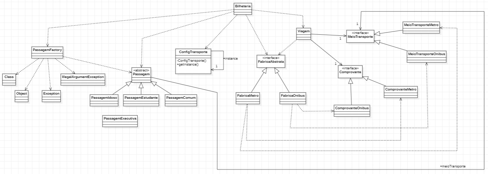

# Desafio integração de padrões de criação com padrão Bridge, Passagem de Transporte Público

#### Nome: João Vitor Fernandes Ribeiro Carneiro Ramos
#### Matrícula: 202165076C

Implementação dos padrões de projeto **Singleton**, **Factory Method**, **Abstract Factory**, **Bridge** em Java.

## Diagrama UML

